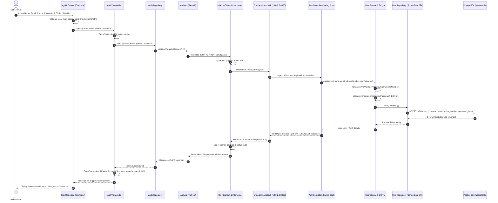
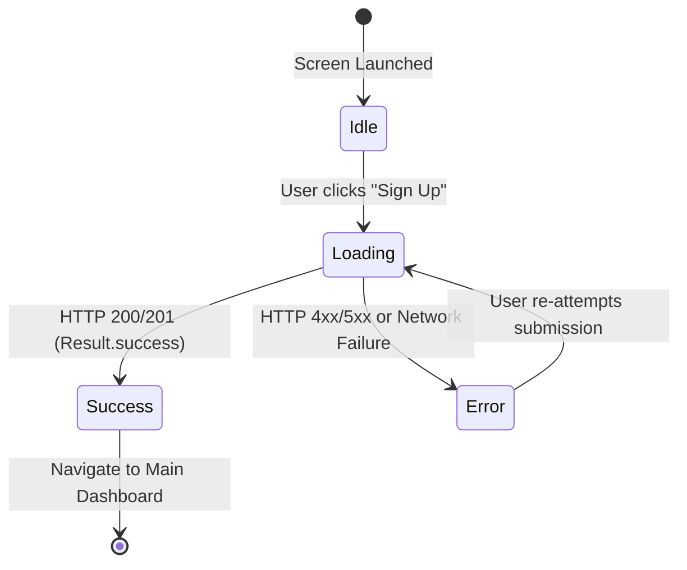

# Mobile-to-Backend Integration Pipeline Technical Specification
**Project**: Energy Android Application & SmartMoney Intelligence Backend  
**Document**: `tobackend.md`  
**Target Backend**: Spring Boot Service (`SM-BACKEND` @ `http://10.0.2.2:8080/`)  
**Target Mobile**: Android Kotlin Client (`com.example.energy`)  
**Status**: Production-Ready Reference  

---

## 1. Architecture & End-to-End Data Flow

### 1.1 Architectural Overview
The integration between the Android mobile client and the Spring Boot backend follows clean architecture principles with strict separation of concerns across presentation, domain, data, network, and persistence layers. 

The transaction lifecycle for user registration flows across the following components:
1. **Jetpack Compose UI** ([`SignUpScreen.kt`](file:///home/frank/AndroidStudioProjects/energy/app/src/main/java/com/example/energy/ui/auth/SignUpScreen.kt)): Captures user input (`name`, `email`, `password`, `phoneNumber`), performs local UI validations (email regex, password length, non-empty checks), and invokes the ViewModel.
2. **ViewModel** ([`AuthViewModel.kt`](file:///home/frank/AndroidStudioProjects/energy/app/src/main/java/com/example/energy/ui/auth/AuthViewModel.kt)): Emits reactive states (`AuthUiState.Loading`, `AuthUiState.Success`, `AuthUiState.Error`) and offloads work to background threads using coroutines (`viewModelScope.launch`).
3. **Repository Layer** ([`AuthRepository.kt`](file:///home/frank/AndroidStudioProjects/energy/app/src/main/java/com/example/energy/domain/repository/AuthRepository.kt) / [`AuthRepositoryImpl.kt`](file:///home/frank/AndroidStudioProjects/energy/app/src/main/java/com/example/energy/data/repository/AuthRepositoryImpl.kt)): Abstracts network transport and business rules, converting raw DTO results into Kotlin `Result<T>` or domain models.
4. **Retrofit API Interface** ([`AuthApi.kt`](file:///home/frank/AndroidStudioProjects/energy/app/src/main/java/com/example/energy/data/remote/api/AuthApi.kt)): Defines the HTTP contract (`@POST("api/auth/register")`) with structured request/response payload classes.
5. **OkHttp Network Engine & Interceptor** ([`RetrofitClient.kt`](file:///home/frank/AndroidStudioProjects/energy/app/src/main/java/com/example/energy/data/remote/RetrofitClient.kt)): Manages HTTP connection pooling, socket timeouts, JSON serialization (via Kotlinx Serialization), and low-level HTTP logging (`HttpLoggingInterceptor`).
6. **Virtual Network Loopback**: Translates the emulator's virtual network interface (`10.0.2.2:8080`) to the developer host's loopback (`127.0.0.1:8080`).
7. **Spring Boot REST Controller** (`AuthController.java`): Ingests the JSON payload into a `RegisterRequest` Java DTO and validates request integrity.
8. **Service Layer & Password Hashing** ([`UserService.java`](file:///home/frank/SmartMoney_intelligence/SM-BACKEND/src/main/java/com/example/smbackend/service/UserService.java)): Normalizes fields, validates phone constraints (7–20 characters), and hashes raw credentials using Spring Security's `PasswordEncoder` (BCrypt).
9. **Spring Data JPA Repository** ([`UserRepository.java`](file:///home/frank/SmartMoney_intelligence/SM-BACKEND/src/main/java/com/example/smbackend/repository/UserRepository.java)): Translates the domain entity into PostgreSQL dialect SQL statements.
10. **PostgreSQL Database** (`users` table): Persists the user record with UUID primary keys and transactional integrity.

---

### 1.2 End-to-End Sequence Diagram



---

## 2. Android Network & Security Configuration

### 2.1 The Android Emulator Loopback Trap (`10.0.2.2` vs `localhost`)
Android emulators execute inside an isolated QEMU virtual machine environment behind a virtual router/firewall (default subnet `10.0.2.0/24`):
- **`127.0.0.1` / `localhost` inside the Emulator**: Resolves to the emulator's *own* loopback interface (the virtual device itself). If an Android app targets `http://127.0.0.1:8080/`, it searches for a server running inside the Android VM, failing immediately with:
  ```
  java.net.ConnectException: Failed to connect to /127.0.0.1:8080
  ```
- **`10.0.2.2` inside the Emulator**: A special network alias provided by the Android emulator runtime that routes packets directly to the host machine's `127.0.0.1` loopback interface.
- **Physical Device Consideration**: If debugging on a physical Android device connected via Wi-Fi or USB tethering, `10.0.2.2` does not apply. Instead, configure the workstation's local LAN IP (e.g., `http://192.168.1.105:8080/`) or establish an ADB reverse port-forward:
  ```bash
  adb reverse tcp:8080 tcp:8080
  # When reverse port-forwarded, the mobile app can safely use http://localhost:8080/
  ```

---

### 2.2 Cleartext Traffic Allowance (`AndroidManifest.xml`)
Starting in **Android 9 (API Level 28)**, Android enforces Network Security Policy constraints that disable cleartext (unencrypted HTTP) communication by default. Any attempt to query `http://` endpoints produces:
```
java.net.UnknownServiceException: CLEARTEXT communication to 10.0.2.2 not permitted by network security policy
```

To enable communication with local development servers over HTTP, the following entries are mandatory in [`app/src/main/AndroidManifest.xml`](file:///home/frank/AndroidStudioProjects/energy/app/src/main/AndroidManifest.xml):

```xml
<?xml version="1.0" encoding="utf-8"?>
<manifest xmlns:android="http://schemas.android.com/apk/res/android"
    xmlns:tools="http://schemas.android.com/tools">

    <!-- Grants permission to open network sockets -->
    <uses-permission android:name="android.permission.INTERNET" />

    <application
        android:allowBackup="true"
        <!-- Permits unencrypted HTTP connections for local development (10.0.2.2) -->
        android:usesCleartextTraffic="true"
        android:dataExtractionRules="@xml/data_extraction_rules"
        android:fullBackupContent="@xml/backup_rules"
        android:icon="@mipmap/system"
        android:label="@string/app_name"
        android:roundIcon="@mipmap/system"
        android:supportsRtl="true"
        android:theme="@style/Theme.Energy">
        
        <activity
            android:name=".MainActivity"
            android:exported="true"
            android:theme="@style/Theme.Energy">
            <intent-filter>
                <action android:name="android.intent.action.MAIN" />
                <category android:name="android.intent.category.LAUNCHER" />
            </intent-filter>
        </activity>
    </application>
</manifest>
```

---

### 2.3 Production Network Security Architecture
In production, cleartext traffic must never be globally allowed. The system switches to encrypted transport via:

1. **Gradle Build Configurations**:
   ```kotlin
   // app/build.gradle.kts
   buildTypes {
       debug {
           buildConfigField("String", "API_BASE_URL", "\"http://10.0.2.2:8080/\"")
       }
       release {
           isMinifyEnabled = true
           proguardFiles(getDefaultProguardFile("proguard-android-optimize.txt"), "proguard-rules.pro")
           buildConfigField("String", "API_BASE_URL", "\"https://api.smartmoney.production.com/\"")
       }
   }
   ```
2. **Granular Network Security Config (`res/xml/network_security_config.xml`)**:
   Instead of global `android:usesCleartextTraffic="true"`, production applications restrict cleartext traffic solely to debug builds and specific localhost domains:
   ```xml
   <?xml version="1.0" encoding="utf-8"?>
   <network-security-config>
       <domain-config cleartextTrafficPermitted="true">
           <domain includeSubdomains="true">10.0.2.2</domain>
           <domain includeSubdomains="true">localhost</domain>
       </domain-config>
       <base-config cleartextTrafficPermitted="false">
           <trust-anchors>
               <certificates src="system" />
           </trust-anchors>
       </base-config>
   </network-security-config>
   ```

---

## 3. Retrofit Client & API Contract Specification

### 3.1 Retrofit Client Configuration (`RetrofitClient.kt`)
The Retrofit client is configured as a thread-safe Kotlin singleton object in [`RetrofitClient.kt`](file:///home/frank/AndroidStudioProjects/energy/app/src/main/java/com/example/energy/data/remote/RetrofitClient.kt):

```kotlin
package com.example.energy.data.remote

import com.example.energy.data.remote.api.AuthApi
import kotlinx.serialization.json.Json
import okhttp3.MediaType.Companion.toMediaType
import okhttp3.OkHttpClient
import okhttp3.logging.HttpLoggingInterceptor
import retrofit2.Retrofit
import retrofit2.converter.kotlinx.serialization.asConverterFactory
import java.util.concurrent.TimeUnit

object RetrofitClient {

    private const val BASE_URL = "http://10.0.2.2:8080/"

    private val json = Json {
        ignoreUnknownKeys = true     // Prevents crashes when backend returns extra fields
        isLenient = true             // Tolerates malformed JSON formatting
        encodeDefaults = true        // Includes default values in serialized JSON
        coerceInputValues = true     // Coerces nulls into default values where valid
    }

    private val loggingInterceptor = HttpLoggingInterceptor().apply {
        level = HttpLoggingInterceptor.Level.BODY
    }

    private val okHttpClient: OkHttpClient = OkHttpClient.Builder()
        .addInterceptor(loggingInterceptor)
        .connectTimeout(30, TimeUnit.SECONDS)
        .readTimeout(30, TimeUnit.SECONDS)
        .writeTimeout(30, TimeUnit.SECONDS)
        .build()

    private val retrofit: Retrofit = Retrofit.Builder()
        .baseUrl(BASE_URL)
        .client(okHttpClient)
        .addConverterFactory(json.asConverterFactory("application/json".toMediaType()))
        .build()

    val authApi: AuthApi by lazy {
        retrofit.create(AuthApi::class.java)
    }
}
```

#### Key Technical Decisions:
- **`asConverterFactory("application/json".toMediaType())`**: Utilizes official `converter-kotlinx-serialization` from Square, maintaining binary compatibility with Kotlin 2.2 without requiring external reflection libraries like Gson.
- **`HttpLoggingInterceptor.Level.BODY`**: Captures outgoing HTTP method, headers, full request payload body, HTTP status codes, execution duration, and response body in Logcat.
- **Lazy Initialization (`by lazy`)**: The `AuthApi` reflection proxy is constructed on first access, optimizing cold application launch performance.

---

### 3.2 API Contract & Schema Definition (`AuthApi.kt`)
Located in [`AuthApi.kt`](file:///home/frank/AndroidStudioProjects/energy/app/src/main/java/com/example/energy/data/remote/api/AuthApi.kt):

```kotlin
package com.example.energy.data.remote.api

import kotlinx.serialization.SerialName
import kotlinx.serialization.Serializable
import retrofit2.Response
import retrofit2.http.Body
import retrofit2.http.POST

@Serializable
data class RegisterRequest(
    @SerialName("name")
    val name: String,

    @SerialName("email")
    val email: String,

    @SerialName("phoneNumber")
    val phoneNumber: String? = null,

    @SerialName("password")
    val password: String
)

@Serializable
data class LoginRequest(
    @SerialName("email")
    val email: String,

    @SerialName("password")
    val password: String
)

@Serializable
data class AuthResponse(
    @SerialName("id")
    val id: String? = null,

    @SerialName("name")
    val name: String? = null,

    @SerialName("email")
    val email: String? = null,

    @SerialName("phoneNumber")
    val phoneNumber: String? = null,

    @SerialName("token")
    val token: String? = null,

    @SerialName("accessToken")
    val accessToken: String? = null,

    @SerialName("tokenType")
    val tokenType: String? = null,

    @SerialName("message")
    val message: String? = null
)

interface AuthApi {

    @POST("api/auth/register")
    suspend fun register(
        @Body request: RegisterRequest
    ): Response<AuthResponse>

    @POST("api/auth/login")
    suspend fun login(
        @Body request: LoginRequest
    ): Response<AuthResponse>
}
```

---

### 3.3 JSON Field Mapping Matrix

| Kotlin DTO Property | `@SerialName` Annotation | Expected JSON Key | Spring Boot Java Field | DB Column (`users`) |
| :--- | :--- | :--- | :--- | :--- |
| `val name: String` | `@SerialName("name")` | `"name"` | `String name` | `name` (`TEXT NOT NULL`) |
| `val email: String` | `@SerialName("email")` | `"email"` | `String email` | `email` / `email_address` |
| `val phoneNumber: String?` | `@SerialName("phoneNumber")` | `"phoneNumber"` | `String phoneNumber` | `phone_number` (`VARCHAR(20)`) |
| `val password: String` | `@SerialName("password")` | `"password"` | `String rawPassword` | `password_hash` (`TEXT NOT NULL`) |

> [!NOTE]
> Spring Boot's default Jackson ObjectMapper translates camelCase JSON keys directly into Java Bean properties or constructor parameters without custom serializer modules.

---

## 4. UI & ViewModel Delegation

### 4.1 Input Flow in `SignUpScreen.kt`
The user interface is built declaratively with Jetpack Compose in [`SignUpScreen.kt`](file:///home/frank/AndroidStudioProjects/energy/app/src/main/java/com/example/energy/ui/auth/SignUpScreen.kt):
1. User types into `OutlinedTextField` components bound to mutable states: `name`, `email`, `password`, `phoneNumber`.
2. Upon clicking the **Sign Up** button, client-side sanity checks execute synchronously on the Main thread:
   ```kotlin
   if (name.isBlank() || email.isBlank() || password.isBlank()) {
       localValidationMessage = "Please fill in all fields."
   } else if (!android.util.Patterns.EMAIL_ADDRESS.matcher(email).matches()) {
       localValidationMessage = "Please enter a valid email address."
   } else if (password.length < 6) {
       localValidationMessage = "Password must be at least 6 characters."
   } else {
       localValidationMessage = ""
       authViewModel.signUp(name.trim(), email.trim(), password, phoneNumber.trim())
   }
   ```

---

### 4.2 Non-Blocking Coroutine Delegation in `AuthViewModel.kt`
The ViewModel guarantees that network I/O never blocks the Android UI main thread by orchestrating execution within `viewModelScope` on `Dispatchers.IO`:

```kotlin
class AuthViewModel(
    private val authRepository: AuthRepository
) : ViewModel() {

    private val _uiState = MutableStateFlow<AuthUiState>(AuthUiState.Idle)
    val uiState: StateFlow<AuthUiState> = _uiState.asStateFlow()

    fun signUp(name: String, email: String, password: String, phoneNumber: String? = null) {
        viewModelScope.launch(Dispatchers.IO) {
            _uiState.value = AuthUiState.Loading
            
            val result = authRepository.signUp(name, email, password, phoneNumber)
            
            withContext(Dispatchers.Main) {
                result.fold(
                    onSuccess = {
                        _uiState.value = AuthUiState.Success("Account created successfully!")
                    },
                    onFailure = { error ->
                        _uiState.value = AuthUiState.Error(
                            error.localizedMessage ?: "Registration failed. Please check your network."
                        )
                    }
                )
            }
        }
    }
}
```

---

### 4.3 UI State Management (`AuthUiState`)
The UI subscribes to `uiState` via `collectAsState()`:



- **Loading State**: Disables the submission button and replaces button label with a `CircularProgressIndicator`.
- **Error State**: Renders an alert banner in `MaterialTheme.colorScheme.error` with actionable server feedback (e.g. "Email already in use").
- **Success State**: Renders confirmation feedback and triggers automatic navigation to login or dashboard.

---

## 5. Spring Boot Ingestion & Data Persistence

**Backend Directory Reference**: `/home/frank/SmartMoney_intelligence/SM-BACKEND`

### 5.1 Controller Layer (`AuthController.java`)
The Spring Boot controller exposes REST endpoints using `@RestController` and `@RequestMapping("/api/auth")`:

```java
package com.example.smbackend.controller;

import com.example.smbackend.domain.User;
import com.example.smbackend.dto.RegisterRequest;
import com.example.smbackend.service.UserService;
import org.springframework.http.HttpStatus;
import org.springframework.http.ResponseEntity;
import org.springframework.web.bind.annotation.*;

@RestController
@RequestMapping("/api/auth")
public class AuthController {

    private final UserService userService;

    public AuthController(UserService userService) {
        this.userService = userService;
    }

    @PostMapping("/register")
    public ResponseEntity<?> register(@RequestBody RegisterRequest request) {
        try {
            User createdUser = userService.createUser(
                request.getName(),
                request.getEmail(),
                request.getPhoneNumber(),
                request.getPassword()
            );
            return ResponseEntity.status(HttpStatus.CREATED).body(createdUser);
        } catch (IllegalArgumentException e) {
            return ResponseEntity.status(HttpStatus.BAD_REQUEST).body(e.getMessage());
        }
    }
}
```

---

### 5.2 Service Layer & Password Hashing ([`UserService.java`](file:///home/frank/SmartMoney_intelligence/SM-BACKEND/src/main/java/com/example/smbackend/service/UserService.java))
The service layer enforces business constraints and security hashing:

```java
@Service
public class UserService {

    private final UserRepository userRepository;
    private final PasswordEncoder passwordEncoder;

    public UserService(UserRepository userRepository, PasswordEncoder passwordEncoder) {
        this.userRepository = userRepository;
        this.passwordEncoder = passwordEncoder;
    }

    public User createUser(String name, String email, String phoneNumber, String rawPassword) {
        // Step 1: Normalize and validate phone number (7-20 chars)
        String validatedPhoneNumber = normalizeAndValidatePhoneNumber(phoneNumber);

        // Step 2: Hash raw password using Spring Security's BCryptPasswordEncoder
        String passwordHash = passwordEncoder.encode(rawPassword);

        // Step 3: Instantiate domain entity
        User user = new User(name, email, validatedPhoneNumber, passwordHash);

        // Step 4: Persist via Spring Data JPA
        return userRepository.save(user);
    }
}
```

---

### 5.3 Database Entity Mapping & PostgreSQL Schema
Entity definition in [`User.java`](file:///home/frank/SmartMoney_intelligence/SM-BACKEND/src/main/java/com/example/smbackend/domain/User.java):

```java
@Entity
@Table(name = "users")
public class User {

    @Id
    @GeneratedValue(strategy = GenerationType.UUID)
    @Column(name = "id", updatable = false, nullable = false)
    private UUID id;

    @Column(name = "name", nullable = false)
    private String name;

    @Column(name = "email", nullable = false, unique = true)
    private String email;

    @Column(name = "password_hash", nullable = false)
    private String passwordHash;

    @Column(name = "phone_number", length = 20)
    private String phoneNumber;
}
```

Corresponding PostgreSQL schema definition ([`users.sql`](file:///home/frank/SmartMoney_intelligence/database_schema/users.sql)):
```sql
CREATE TABLE users (
    id UUID PRIMARY KEY DEFAULT gen_random_uuid(),
    name TEXT NOT NULL CHECK (char_length(trim(name)) BETWEEN 2 AND 100),
    email_address TEXT NOT NULL CHECK (char_length(email_address) <= 254),
    password_hash TEXT NOT NULL CHECK (char_length(password_hash) BETWEEN 20 AND 500),
    phone_number TEXT CHECK (phone_number IS NULL OR char_length(phone_number) BETWEEN 7 AND 20),
    created_at TIMESTAMPTZ NOT NULL DEFAULT NOW(),
    updated_at TIMESTAMPTZ NOT NULL DEFAULT NOW()
);

CREATE UNIQUE INDEX users_email_active_unique ON users(email_address);
```

---

## 6. Verification, Logging & Observability Checkpoints

When running the mobile client against the local backend, monitor these 3 checkpoints:

```
[Mobile Client: Logcat]  --->  [Spring Boot: Console/Tomcat]  --->  [PostgreSQL: psql]
     (Checkpoint A)                    (Checkpoint B)                   (Checkpoint C)
```

### Checkpoint A (Mobile Client): Android Studio Logcat
In Android Studio, open the **Logcat** tab and set the filter tag to:
```text
package:mine tag:OkHttp
```
**Expected Outgoing Log**:
```http
--> POST http://10.0.2.2:8080/api/auth/register
Content-Type: application/json; charset=UTF-8
Content-Length: 98

{"name":"John Doe","email":"john.doe@example.com","phoneNumber":"+254712345678","password":"SecretPassword123"}
--> END POST (98-byte body)
```
**Expected Incoming Log**:
```http
<-- 201 Created http://10.0.2.2:8080/api/auth/register (182ms)
Content-Type: application/json
Transfer-Encoding: chunked

{"id":"c3b52a12-8874-4b57-b08e-17684dd36cf6","name":"John Doe","email":"john.doe@example.com","phoneNumber":"+254712345678"}
<-- END HTTP (124-byte body)
```

---

### Checkpoint B (Backend Service): Spring Boot Console
In the terminal running `SM-BACKEND` (`./mvnw spring-boot:run`):
1. **DispatcherServlet Ingestion**:
   ```text
   DEBUG o.s.web.servlet.DispatcherServlet - POST "/api/auth/register", parameters={}
   DEBUG o.s.w.s.m.m.a.HttpEntityMethodProcessor - Read "application/json;charset=UTF-8" to [RegisterRequest[name='John Doe', email='john.doe@example.com', phoneNumber='+254712345678']]
   ```
2. **Hibernate SQL Execution** (enabled via `spring.jpa.show-sql=true` in `application.yml`):
   ```sql
   Hibernate: 
       insert 
       into
           users
           (email, name, password_hash, phone_number, id) 
       values
           (?, ?, ?, ?, ?)
   ```
3. **HTTP 201 Response Generation**:
   ```text
   DEBUG o.s.web.servlet.DispatcherServlet - Completed 201 CREATED
   ```

---

### Checkpoint C (Database): PostgreSQL Direct Verification
Open `psql` or a PostgreSQL GUI connected to `sm_intelligence`:

```bash
docker exec -it <postgres_container_name> psql -U postgres -d sm_intelligence
```
Execute query:
```sql
SELECT 
    id, 
    name, 
    email, 
    phone_number, 
    substring(password_hash from 1 for 15) || '...' AS hashed_credential 
FROM users 
WHERE email = 'john.doe@example.com';
```
**Expected Output Table**:
```
                  id                  |   name   |        email          |  phone_number  |  hashed_credential
--------------------------------------+----------+-----------------------+----------------+--------------------
 c3b52a12-8874-4b57-b08e-17684dd36cf6 | John Doe | john.doe@example.com  | +254712345678  | $2a$10$w8T9H3v...
(1 row)
```

---

## 7. Common Integration Pitfalls & Troubleshooting

| Error Symptom | Root Cause | Exact Resolution |
| :--- | :--- | :--- |
| `java.net.ConnectException: Failed to connect to /127.0.0.1:8080` | **Localhost Trap**: Android emulator attempted to reach port 8080 inside its own isolated VM rather than the host machine. | Update `BASE_URL` in [`RetrofitClient.kt`](file:///home/frank/AndroidStudioProjects/energy/app/src/main/java/com/example/energy/data/remote/RetrofitClient.kt) to `"http://10.0.2.2:8080/"`. If using a physical device, execute `adb reverse tcp:8080 tcp:8080`. |
| `java.net.UnknownServiceException: CLEARTEXT communication to 10.0.2.2 not permitted by network security policy` | **Android 9+ Cleartext Restriction**: Unencrypted HTTP traffic blocked by Android's default network security policy. | Ensure `android:usesCleartextTraffic="true"` is configured in [`AndroidManifest.xml`](file:///home/frank/AndroidStudioProjects/energy/app/src/main/AndroidManifest.xml) under `<application>`, or supply a debug `network_security_config.xml`. |
| `PSQLException: ERROR: null value in column "phone_number" violates not-null constraint` | **Schema Mismatch**: The database schema or entity specifies `nullable = false`, but client sent null or omitted the field. | Provide a non-null placeholder or validate that `phoneNumber` is populated before submitting. Alternatively, alter table to allow nullable phone numbers: `ALTER TABLE users ALTER COLUMN phone_number DROP NOT NULL;`. |
| `HTTP 403 Forbidden` on `POST /api/auth/register` | **Spring Security CSRF / Auth Lock**: Spring Security starter enabled by default, blocking state-changing POST requests without CSRF token or session. | In Spring Boot `SecurityConfig.java`, disable CSRF for stateless REST APIs and whitelist the auth path:<br>`http.csrf(csrf -> csrf.disable()).authorizeHttpRequests(auth -> auth.requestMatchers("/api/auth/**").permitAll().anyRequest().authenticated());` |
| `SerializationException: Field 'xyz' is required ... but it was missing` | **Strict JSON Deserialization**: Kotlinx Serialization failed because a field returned by backend was missing or null in Kotlin DTO. | In [`RetrofitClient.kt`](file:///home/frank/AndroidStudioProjects/energy/app/src/main/java/com/example/energy/data/remote/RetrofitClient.kt), ensure `Json { ignoreUnknownKeys = true; coerceInputValues = true }` is configured, and ensure all non-mandatory response fields in DTOs are declared as nullable with default values (e.g., `= null`). |
| `java.net.SocketTimeoutException: timeout` | **Host Firewall / Suspended Backend**: Backend server is not running, listening on wrong interface (`127.0.0.1` instead of `0.0.0.0`), or host firewall is dropping incoming emulator connections. | Verify backend is active (`curl -I http://localhost:8080/api/auth/health`). Increase `OkHttpClient` connect/read timeout to 30s. |

---

## 8. Summary of Relevant File Paths

- **Android Client Project**: `/home/frank/AndroidStudioProjects/energy`
  * Network Client: [`app/src/main/java/com/example/energy/data/remote/RetrofitClient.kt`](file:///home/frank/AndroidStudioProjects/energy/app/src/main/java/com/example/energy/data/remote/RetrofitClient.kt)
  * API Contract: [`app/src/main/java/com/example/energy/data/remote/api/AuthApi.kt`](file:///home/frank/AndroidStudioProjects/energy/app/src/main/java/com/example/energy/data/remote/api/AuthApi.kt)
  * DTO Aliases: [`app/src/main/java/com/example/energy/data/remote/dto/AuthDto.kt`](file:///home/frank/AndroidStudioProjects/energy/app/src/main/java/com/example/energy/data/remote/dto/AuthDto.kt)
  * Manifest: [`app/src/main/AndroidManifest.xml`](file:///home/frank/AndroidStudioProjects/energy/app/src/main/AndroidManifest.xml)
  * Unit Tests: [`app/src/test/java/com/example/energy/AuthApiSerializationTest.kt`](file:///home/frank/AndroidStudioProjects/energy/app/src/test/java/com/example/energy/AuthApiSerializationTest.kt)
- **Spring Boot Backend**: `/home/frank/SmartMoney_intelligence/SM-BACKEND`
  * Configuration: [`src/main/resources/application.yml`](file:///home/frank/SmartMoney_intelligence/SM-BACKEND/src/main/resources/application.yml)
  * Service Layer: [`src/main/java/com/example/smbackend/service/UserService.java`](file:///home/frank/SmartMoney_intelligence/SM-BACKEND/src/main/java/com/example/smbackend/service/UserService.java)
  * Domain Entity: [`src/main/java/com/example/smbackend/domain/User.java`](file:///home/frank/SmartMoney_intelligence/SM-BACKEND/src/main/java/com/example/smbackend/domain/User.java)
  * Repository: [`src/main/java/com/example/smbackend/repository/UserRepository.java`](file:///home/frank/SmartMoney_intelligence/SM-BACKEND/src/main/java/com/example/smbackend/repository/UserRepository.java)
  * Database Schema: [`database_schema/users.sql`](file:///home/frank/SmartMoney_intelligence/database_schema/users.sql)
