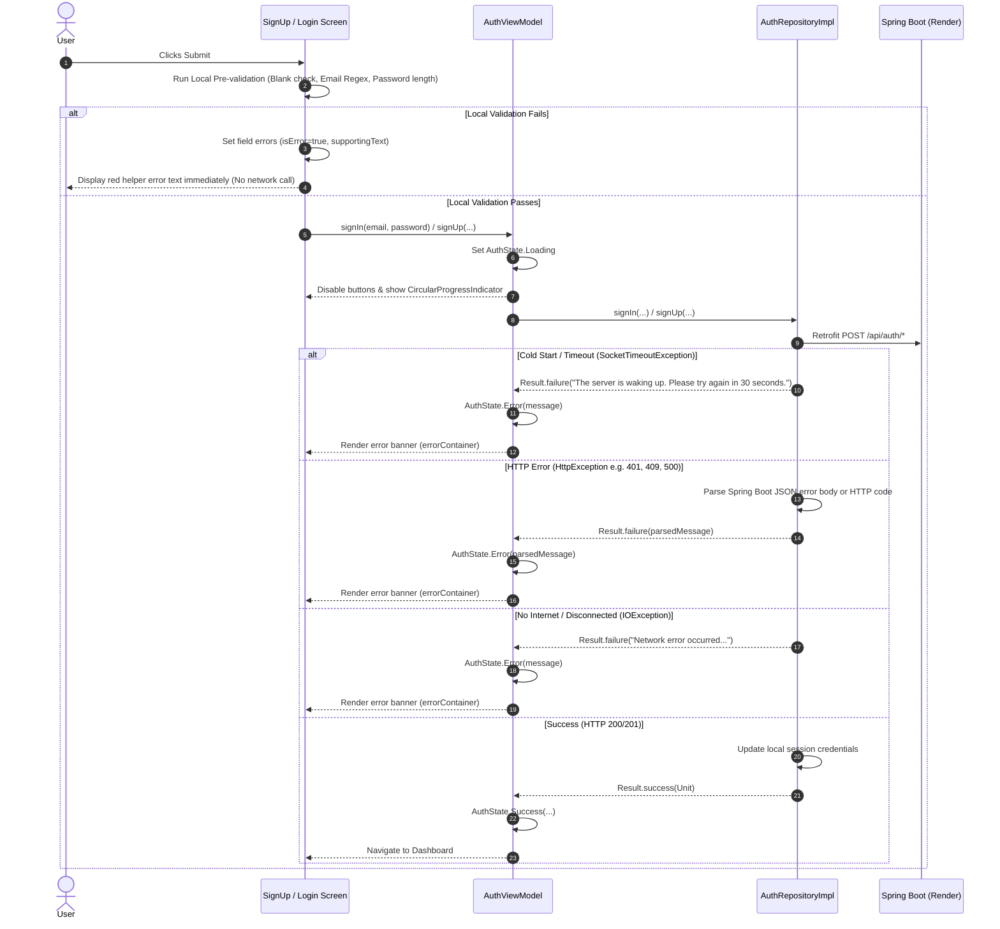

# Authentication Error Handling & Input Validation Documentation

This document outlines the comprehensive error handling and input validation architecture implemented for the Authentication flow (Sign Up and Log In) in the **Android Energy App (SM-Intelligence)**.

---

## 1. Architectural Overview

The authentication pipeline follows modern Android Clean Architecture and Jetpack Compose best practices, dividing responsibilities cleanly across three distinct layers:

```
+-------------------------------------------------------------------------+
|                               UI LAYER                                  |
|  - SignUpScreen.kt & LoginScreen.kt                                     |
|  - Pre-validation (Regex, blank checks, length)                         |
|  - Material 3 error states (supportingText, Error banners, Loading)     |
+------------------------------------+------------------------------------+
                                     |
                                     v
+------------------------------------+------------------------------------+
|                            VIEWMODEL LAYER                              |
|  - AuthViewModel.kt & AuthState.kt                                      |
|  - Exposes StateFlow<AuthState> (Idle, Loading, Success, Error)         |
|  - Unpacks Repository Result<Unit> and emits UI states                  |
+------------------------------------+------------------------------------+
                                     |
                                     v
+------------------------------------+------------------------------------+
|                          REPOSITORY LAYER                               |
|  - AuthRepositoryImpl.kt & AuthRemoteDataSource.kt                      |
|  - Catches SocketTimeoutException (Render cold starts)                  |
|  - Catches HttpException (Spring Boot error body parser)                |
|  - Catches IOException (Connectivity drops)                             |
|  - Returns Result.success(Unit) or Result.failure(Exception)            |
+------------------------------------+------------------------------------+
                                     |
                                     v
+------------------------------------+------------------------------------+
|                         BACKEND SERVICE                                 |
|  - Spring Boot REST API hosted on Render                                |
+-------------------------------------------------------------------------+
```

---

## 2. Layer-by-Layer Implementation

### 2.1 Repository & Network Layer (`AuthRepositoryImpl.kt`)

The Spring Boot backend is hosted on Render's free/starter tier, which spins down dynos after inactivity. As a result, requests can time out or return transient gateway codes while the service wakes up.

#### Key Implementations:
1. **Render Cold Start Mitigation (`SocketTimeoutException`)**:
   - Explicitly caught before general I/O exceptions.
   - Mapped to an actionable, user-friendly notice:
     > *"The server is waking up. Please try again in 30 seconds."*

2. **Spring Boot Error Parsing (`HttpException`)**:
   - Inspects the HTTP status code.
   - Extracts and parses the response error body string.
   - Parses Spring Boot's JSON error format (extracting `"message"` or `"error"` attributes).
   - If JSON parsing fails (e.g. raw text or proxy error), falls back to status code messages:
     - `400`: *"Invalid request. Please verify your details."*
     - `401`: *"Invalid email or password."*
     - `403`: *"Access denied. You do not have permission to perform this action."*
     - `404`: *"Authentication endpoint not found."*
     - `409`: *"An account with this email already exists."*
     - `500`: *"Internal server error. Please try again later."*
     - `502, 503, 504`: *"The server is waking up. Please try again in 30 seconds."*

3. **General Network Failure (`IOException`)**:
   - Catches socket disruptions, offline states, and DNS failures.
   - Mapped to: *"Network error occurred. Please check your internet connection and try again."*

4. **Result Encapsulation**:
   - All outcomes are delivered through standard Kotlin `Result<Unit>`, wrapping user-facing strings into `Result.failure(Exception(mappedMessage))` without leaking low-level stack traces to the UI.

---

### 2.2 ViewModel Layer (`AuthViewModel.kt` & `AuthState.kt`)

The ViewModel coordinates UI state changes and isolates business logic from Android framework lifecycles.

#### Key Implementations:
1. **Sealed Interface `AuthState`**:
   - `AuthState.Idle`: Form is ready for user input.
   - `AuthState.Loading`: Network request is in flight.
   - `AuthState.Success(val message: String)`: Authentication completed successfully.
   - `AuthState.Error(val message: String)`: An error occurred (local or remote).
   - A type alias `AuthUiState = AuthState` is maintained for backward compatibility.

2. **Clean Result Collection**:
   - Both `signUp` and `signIn` invoke coroutines on `viewModelScope`.
   - The UI state is set to `AuthState.Loading` before invoking the repository.
   - `result.fold` safely inspects the outcome:
     - On failure: Emits `AuthState.Error(error.localizedMessage ?: "...")`.
     - On success: Emits `AuthState.Success(...)`.

3. **State Resets**:
   - `clearState()` provides a clean way for the UI to dismiss stale errors when the user edits fields or navigates between screens.

---

### 2.3 UI Layer & Local Validation (`LoginScreen.kt` & `SignUpScreen.kt`)

Input validation occurs client-side before any network request is initiated. This saves battery, bandwidth, and prevents unnecessary wakeups for sleeping servers.

#### Local Pre-Validation Rules:
| Field | Rules / Constraints | Error Feedback |
| :--- | :--- | :--- |
| **All Fields** | Must not be empty or whitespace | *"Field cannot be blank"* / *"Email cannot be blank"* |
| **Email** | Standard regex: `^[A-Za-z0-9._%+-]+@[A-Za-z0-9.-]+\.[A-Za-z]{2,}$` | *"Please enter a valid email address"* |
| **Password** | Length must be $\ge 6$ characters | *"Password must be at least 6 characters"* |
| **Phone Number** *(Sign Up)* | Length must be between 7 and 20 characters | *"Phone number must be between 7 and 20 characters"* |

#### Material 3 UI Patterns:
1. **Field-Level Errors**:
   - Each `OutlinedTextField` binds `isError = fieldError != null`.
   - `supportingText` displays the error message styled with `MaterialTheme.colorScheme.error` and `MaterialTheme.typography.bodySmall`.
   - Errors clear dynamically as soon as the user modifies the corresponding input.

2. **Top-Level Backend / Network Error Banner**:
   - When `AuthState.Error` is emitted by the ViewModel, a Material 3 `Card` is displayed above the input fields.
   - Styled with `MaterialTheme.colorScheme.errorContainer` container color and `MaterialTheme.colorScheme.onErrorContainer` content color, accompanied by an `Icons.Default.ErrorOutline` indicator.

3. **Loading State & Button Interactivity**:
   - When `authState is AuthState.Loading`:
     - The submit `Button` is disabled to prevent duplicate concurrent submissions.
     - Secondary navigation buttons (switching between Sign Up and Login) are disabled.
     - A `CircularProgressIndicator` with `strokeWidth = 2.5.dp` and `color = MaterialTheme.colorScheme.onPrimary` is shown inside the button.

4. **Usability Enhancements**:
   - **Keyboard Navigation**: Appropriate `KeyboardType` (`Email`, `Password`, `Phone`) and `ImeAction` (`Next`, `Done`).
   - **Password Visibility**: Interactive toggle using `Icons.Default.Visibility` and `Icons.Default.VisibilityOff`.
   - **Scroll Resilience**: Root columns include `Modifier.verticalScroll(rememberScrollState())` to prevent layout clipping when soft keyboards appear.

---

## 3. Error Handling Workflow Diagram



---

## 4. Summary of Modified Files

- [`app/src/main/java/com/example/energy/data/repository/AuthRepositoryImpl.kt`](file:///home/frank/AndroidStudioProjects/energy/app/src/main/java/com/example/energy/data/repository/AuthRepositoryImpl.kt): Wrapped Retrofit calls in `try-catch`, explicit `SocketTimeoutException`, `HttpException` JSON parser, and `IOException` handler.
- [`app/src/main/java/com/example/energy/data/remote/datasource/AuthRemoteDataSource.kt`](file:///home/frank/AndroidStudioProjects/energy/app/src/main/java/com/example/energy/data/remote/datasource/AuthRemoteDataSource.kt): Added `updateSession` to ensure session persistence across calls.
- [`app/src/main/java/com/example/energy/ui/auth/AuthState.kt`](file:///home/frank/AndroidStudioProjects/energy/app/src/main/java/com/example/energy/ui/auth/AuthState.kt): Declared `sealed interface AuthState` with `Idle`, `Loading`, `Success`, and `Error`, plus backward-compatible `AuthUiState` typealias.
- [`app/src/main/java/com/example/energy/ui/auth/AuthViewModel.kt`](file:///home/frank/AndroidStudioProjects/energy/app/src/main/java/com/example/energy/ui/auth/AuthViewModel.kt): Emits `AuthState` states, handles `Result.fold`, extracts exception messages.
- [`app/src/main/java/com/example/energy/ui/auth/LoginScreen.kt`](file:///home/frank/AndroidStudioProjects/energy/app/src/main/java/com/example/energy/ui/auth/LoginScreen.kt): Client-side pre-validation, Material 3 error styling (`supportingText`, error banner), loading indicator in button.
- [`app/src/main/java/com/example/energy/ui/auth/SignUpScreen.kt`](file:///home/frank/AndroidStudioProjects/energy/app/src/main/java/com/example/energy/ui/auth/SignUpScreen.kt): Comprehensive pre-validation for all four fields, Material 3 error states, loading indicator in button.
