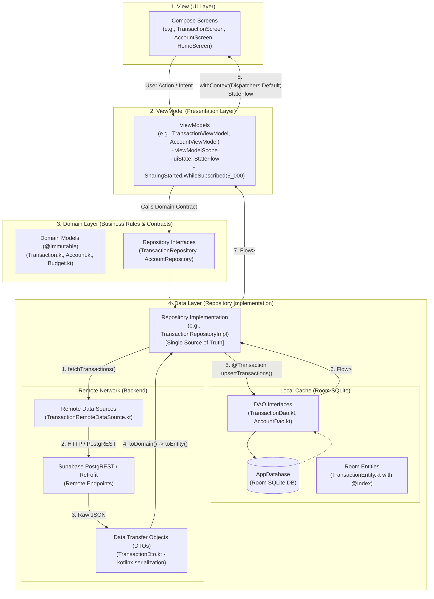
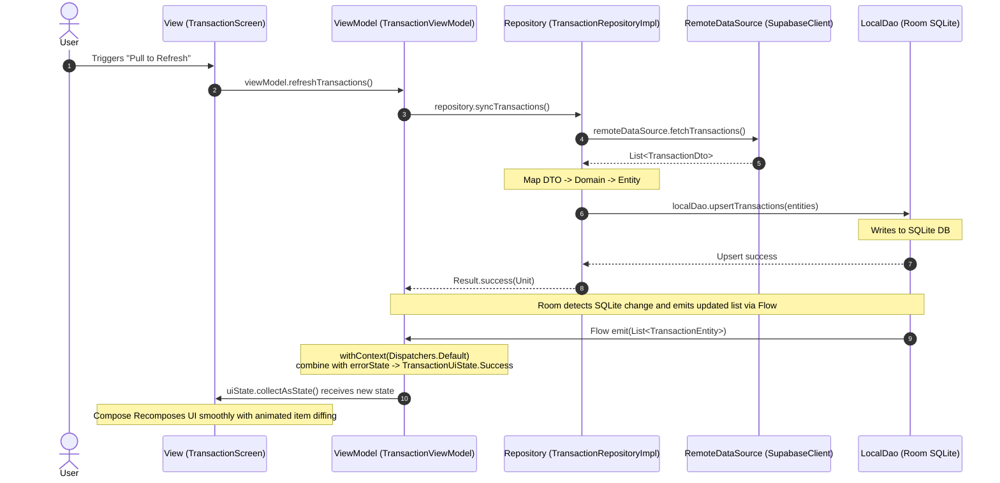

# MVVM Architecture, Data Flow & System Design

## 1. Overview & Architecture Philosophy
The Android Energy application (**SM-Intelligence**) adheres to the **Model-View-ViewModel (MVVM)** design pattern augmented with **Clean Architecture** principles and an **Offline-First Single Source of Truth (SSOT)** strategy.

The architecture strictly separates concerns into decoupled layers:
* **View (UI)**: Declarative Jetpack Compose UI that renders state and dispatches user actions. Zero business, persistence, or network logic.
* **ViewModel (Presentation)**: Lifecycle-aware state holders that expose reactive `StateFlow` to the UI, manage background execution scopes, and orchestrate domain interactions.
* **Model (Domain & Data)**:
  * **Domain Layer**: Platform-independent business entities (`@Immutable` data classes) and repository contracts.
  * **Data Layer (Repository)**: Coordinates between the local SQLite database and remote network clients, enforcing the local database as the single source of truth.
  * **Local Storage (Room SQLite)**: High-speed, indexed local cache that emits reactive data streams via Kotlin `Flow`.
  * **Remote Network (Supabase & Retrofit)**: Remote APIs and clients that handle backend synchronization, authentication, and external services.

---

## 2. System Architecture & Interaction Diagram



---

## 3. Layer-by-Layer Breakdown

### 3.1. The View (UI Layer - Jetpack Compose)
* **Components**: 
  * Screens: [`TransactionScreen.kt`](file:///home/frank/AndroidStudioProjects/energy/app/src/main/java/com/example/energy/ui/transactions/TransactionScreen.kt), [`AccountScreen.kt`](file:///home/frank/AndroidStudioProjects/energy/app/src/main/java/com/example/energy/ui/accounts/AccountScreen.kt), [`HomeScreen.kt`](file:///home/frank/AndroidStudioProjects/energy/app/src/main/java/com/example/energy/ui/home/HomeScreen.kt), [`BudgetScreen.kt`](file:///home/frank/AndroidStudioProjects/energy/app/src/main/java/com/example/energy/ui/budget/BudgetScreen.kt).
  * Shell & Navigation: [`MainResponsiveShell.kt`](file:///home/frank/AndroidStudioProjects/energy/app/src/main/java/com/example/energy/ui/components/MainResponsiveShell.kt), [`DashboardScreen.kt`](file:///home/frank/AndroidStudioProjects/energy/app/src/main/java/com/example/energy/ui/dashboard/DashboardScreen.kt).
* **Role**:
  * Consumes state from the ViewModel via `collectAsState()`.
  * Purely declarative: receives immutable data classes and emits UI components.
  * Dispatches user intentions (clicks, filter changes, pull-to-refresh) directly to ViewModel functions.
  * Optimizations:
    * Lazy lists (`LazyColumn`, `LazyRow`) use explicit unique item keys (e.g., `key = { it.id }`) to avoid re-rendering entire lists on updates.
    * In-memory calculations and string formatters use `remember` and `derivedStateOf` to eliminate unnecessary recompositions and GC churn.

```kotlin
// Example: View observing StateFlow in TransactionScreen.kt
@Composable
fun TransactionScreen(viewModel: TransactionViewModel) {
    val uiState by viewModel.uiState.collectAsState()

    when (val state = uiState) {
        is TransactionUiState.Loading -> LoadingTransactionsView()
        is TransactionUiState.Success -> TransactionsListView(transactions = state.transactions)
        is TransactionUiState.Error -> ErrorTransactionsView(
            message = state.message,
            onRetry = { viewModel.refreshTransactions() }
        )
    }
}
```

---

### 3.2. The ViewModel (Presentation Logic & State Management)
* **Components**: 
  * [`TransactionViewModel.kt`](file:///home/frank/AndroidStudioProjects/energy/app/src/main/java/com/example/energy/ui/transactions/TransactionViewModel.kt), [`AccountViewModel.kt`](file:///home/frank/AndroidStudioProjects/energy/app/src/main/java/com/example/energy/ui/accounts/AccountViewModel.kt), [`BudgetViewModel.kt`](file:///home/frank/AndroidStudioProjects/energy/app/src/main/java/com/example/energy/ui/budget/BudgetViewModel.kt), [`InvestmentViewModel.kt`](file:///home/frank/AndroidStudioProjects/energy/app/src/main/java/com/example/energy/ui/investment/InvestmentViewModel.kt).
* **Role**:
  * **State Retention**: Encapsulates UI state in `StateFlow<UiState>` that survives configuration changes (such as device rotations or theme toggling).
  * **Subscription Lifecycle**: Uses `SharingStarted.WhileSubscribed(5_000)` to stop background database and flow collection 5 seconds after all UI collectors detach (e.g., when navigating away or minimizing the app).
  * **Threading**: Uses `withContext(Dispatchers.Default)` for CPU-intensive data transformations (such as aggregations, summing account balances, and filtering), keeping the Android Main Thread free for 60/120 FPS rendering.
  * **Coroutine Scoping**: All async tasks are tied to `viewModelScope`, ensuring automatic cancellation when the ViewModel is cleared.

```kotlin
// Example: Combining Room Flow with UI error state in TransactionViewModel.kt
val uiState: StateFlow<TransactionUiState> = combine(
    repository.getTransactionsFlow(),
    _errorState
) { cachedTransactions, errorMessage ->
    withContext(Dispatchers.Default) {
        if (errorMessage != null && cachedTransactions.isEmpty()) {
            TransactionUiState.Error(errorMessage)
        } else {
            TransactionUiState.Success(cachedTransactions)
        }
    }
}.stateIn(
    scope = viewModelScope,
    started = SharingStarted.WhileSubscribed(5_000),
    initialValue = TransactionUiState.Loading
)
```

---

### 3.3. The Domain Layer (Core Business Rules & Abstractions)
* **Components**:
  * Models: [`Transaction.kt`](file:///home/frank/AndroidStudioProjects/energy/app/src/main/java/com/example/energy/domain/model/Transaction.kt), [`Account.kt`](file:///home/frank/AndroidStudioProjects/energy/app/src/main/java/com/example/energy/domain/model/Account.kt), [`Budget.kt`](file:///home/frank/AndroidStudioProjects/energy/app/src/main/java/com/example/energy/domain/model/Budget.kt), [`Investment.kt`](file:///home/frank/AndroidStudioProjects/energy/app/src/main/java/com/example/energy/domain/model/Investment.kt).
  * Interfaces: [`TransactionRepository.kt`](file:///home/frank/AndroidStudioProjects/energy/app/src/main/java/com/example/energy/domain/repository/TransactionRepository.kt), [`AccountRepository.kt`](file:///home/frank/AndroidStudioProjects/energy/app/src/main/java/com/example/energy/domain/repository/AccountRepository.kt).
* **Role**:
  * Completely agnostic of Android frameworks, Room, Retrofit, or Supabase.
  * Models are annotated with `@Immutable` to indicate stability to the Compose runtime.
  * Defines repository interfaces enforcing the **Dependency Inversion Principle** (DIP): ViewModels depend on domain contracts, not concrete data implementations.

---

### 3.4. The Data Layer & Repository (Single Source of Truth)
* **Components**:
  * Implementations: [`TransactionRepositoryImpl.kt`](file:///home/frank/AndroidStudioProjects/energy/app/src/main/java/com/example/energy/data/repository/TransactionRepositoryImpl.kt), [`AccountRepositoryImpl.kt`](file:///home/frank/AndroidStudioProjects/energy/app/src/main/java/com/example/energy/data/repository/AccountRepositoryImpl.kt).
* **Role**:
  * Mediates between local storage and remote network services.
  * **Offline-First Strategy**: The UI never directly reads from the network. The UI only observes the local Room database.
  * When synchronization occurs:
    1. Remote data is fetched from the network as DTOs.
    2. DTOs are mapped to Domain models and then to Room Entities.
    3. Entities are inserted into Room using `@Transaction` batch operations.
    4. Room automatically triggers its active `Flow`, notifying the ViewModel without any manual refresh logic.

```kotlin
// Example: SSOT Flow in TransactionRepositoryImpl.kt
class TransactionRepositoryImpl(
    private val remoteDataSource: TransactionRemoteDataSource,
    private val localDao: TransactionDao
) : TransactionRepository {

    // Read Path: Directly from SQLite as a reactive stream
    override fun getTransactionsFlow(accountId: String?): Flow<List<Transaction>> {
        val flow = if (accountId != null) {
            localDao.getTransactionsForAccount(accountId)
        } else {
            localDao.getAllTransactions()
        }
        return flow.map { list -> list.map { it.toDomain() } }
    }

    // Write / Sync Path: Remote fetch -> Cache update
    override suspend fun syncTransactions(accountId: String?): Result<Unit> = runCatching {
        val remoteDtos = remoteDataSource.fetchTransactions(accountId)
        val entities = remoteDtos.map { TransactionEntity.fromDomain(it.toDomain()) }
        localDao.upsertTransactions(entities)
    }
}
```

---

### 3.5. The Local Storage Layer (Room SQLite)
* **Components**:
  * Database: [`AppDatabase.kt`](file:///home/frank/AndroidStudioProjects/energy/app/src/main/java/com/example/energy/data/local/database/AppDatabase.kt) (Room Database).
  * DAOs: [`TransactionDao.kt`](file:///home/frank/AndroidStudioProjects/energy/app/src/main/java/com/example/energy/data/local/dao/TransactionDao.kt), [`AccountDao.kt`](file:///home/frank/AndroidStudioProjects/energy/app/src/main/java/com/example/energy/data/local/dao/AccountDao.kt).
  * Entities: [`TransactionEntity.kt`](file:///home/frank/AndroidStudioProjects/energy/app/src/main/java/com/example/energy/data/local/entity/TransactionEntity.kt), [`AccountEntity.kt`](file:///home/frank/AndroidStudioProjects/energy/app/src/main/java/com/example/energy/data/local/entity/AccountEntity.kt).
* **Role**:
  * Persistent on-device SQLite database.
  * Configured with indices (e.g., `Index(value = ["accountId", "timestamp"])`) to ensure zero-stutter queries when sorting transactions by recency.
  * Batch inserts run inside `@Transaction` blocks, executing atomic multi-row insertions in one SQLite lock cycle.

---

### 3.6. The Remote Network Layer (Supabase & Retrofit)
* **Components**:
  * Clients & Config: [`SupabaseClientProvider.kt`](file:///home/frank/AndroidStudioProjects/energy/app/src/main/java/com/example/energy/data/remote/supabase/SupabaseClientProvider.kt), [`RetrofitClient.kt`](file:///home/frank/AndroidStudioProjects/energy/app/src/main/java/com/example/energy/data/remote/RetrofitClient.kt).
  * Remote Data Sources: [`TransactionRemoteDataSource.kt`](file:///home/frank/AndroidStudioProjects/energy/app/src/main/java/com/example/energy/data/remote/datasource/TransactionRemoteDataSource.kt), [`AccountRemoteDataSource.kt`](file:///home/frank/AndroidStudioProjects/energy/app/src/main/java/com/example/energy/data/remote/datasource/AccountRemoteDataSource.kt).
  * DTOs: [`TransactionDto.kt`](file:///home/frank/AndroidStudioProjects/energy/app/src/main/java/com/example/energy/data/remote/dto/TransactionDto.kt), [`AccountDto.kt`](file:///home/frank/AndroidStudioProjects/energy/app/src/main/java/com/example/energy/data/remote/dto/AccountDto.kt).
* **Role**:
  * Manages remote communications over HTTP/PostgREST.
  * Handles JSON deserialization via `kotlinx.serialization` into Data Transfer Objects (`DTO`).
  * Isolates backend column naming schemas (e.g., snake_case `account_id`, `provider_transaction_id`) from clean Kotlin domain naming schemas.

---

## 4. End-to-End Walkthrough: User Pull-to-Refresh Lifecycle



1. **User Action**: The user pulls down to refresh or navigates to the screen.
2. **ViewModel Event**: The View triggers `viewModel.refreshTransactions()`.
3. **Repository Execution**: The ViewModel launches a coroutine calling `repository.syncTransactions()`.
4. **Remote Fetch**: `TransactionRemoteDataSource` queries Supabase PostgREST for transactions.
5. **Data Transformation**: The repository maps the incoming `TransactionDto` list into `Transaction` domain models, and then into `TransactionEntity` objects.
6. **Atomic Upsert**: `TransactionDao.upsertTransactions()` saves the entities into SQLite in a single transaction.
7. **Reactive Room Emission**: The active `getTransactionsFlow()` query in Room detects that table rows were modified and pushes the new list of entities through the Kotlin `Flow`.
8. **Background Mapping**: The ViewModel collects the flow, applies `withContext(Dispatchers.Default)` to map the list into `TransactionUiState.Success`, and updates `uiState`.
9. **UI Recomposition**: The Composable observing `uiState.collectAsState()` recomposes with the fresh transactions.

---

## 5. Threading & Concurrency Model

| Component | Execution Context / Dispatcher | Purpose |
| :--- | :--- | :--- |
| **Compose UI** | `Dispatchers.Main` | Fast layout measurement, drawing, and animations. Must never be blocked. |
| **ViewModel State Mapping** | `Dispatchers.Default` | CPU-intensive list filtering, balance aggregations, and currency formatting. |
| **Room Database Queries** | Dedicated Room Worker Pool | Asynchronous disk read/write without blocking UI threads. |
| **Network Requests** | `Dispatchers.IO` (handled by Ktor/OkHttp) | Asynchronous non-blocking network socket operations. |

---

## 6. Key Benefits of This Architecture
1. **Zero-Latency UI Rendering (Offline First)**: When a user opens any screen, cached Room data is displayed instantly without waiting for network latency.
2. **Smooth 60/120 FPS Scrolling**: Heavy mathematical computations and date/decimal parsing are offloaded from the main thread.
3. **Resilience to Network Drops**: The app remains functional offline. Any network failures during sync report non-intrusive feedback while existing cached data remains fully accessible.
4. **Testability**: Every layer is decoupled through interfaces. DAOs, RemoteDataSources, and Repositories can all be independently mocked in unit tests without Android UI dependencies.
